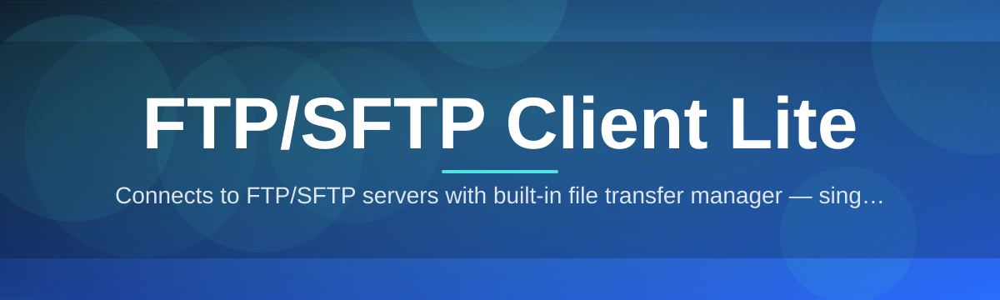

# ftp-sftp-client-manager 📁⚡

  

*A file transfer client that doesn't make you feel like you're debugging a 1998 mainframe.*

  

---

## 🚀 Three Steps, Zero Suffering

1. **Grab it** from the landing page (link below, no funny business).
2. **Run the executable.** No installer wizard interrogating you about toolbars.
3. **Punch in your host, port, and creds** — you're transferring files in under 30 seconds.

That's it. Everything else in this README is just us justifying why we built another FTP/SFTP client in 2026.

---

## 🧭 Overview

Let's be honest — most FTP/SFTP clients feel like they were designed by someone who genuinely enjoys pain. Cluttered panes, seventeen menus for one connection, and a UI that looks like it hasn't been touched since dial-up was cool. **FTP/SFTP Client Lite** exists because file transfer software doesn't need to be a chore. It's a lightweight, standalone Windows client built for developers, sysadmins, and anyone who just needs to move files between a local machine and a remote server without opening a ticket with their own patience.

This isn't a bloated enterprise suite trying to sell you cloud storage add-ons. It's a **focused SFTP and FTP client** that handles secure file transfer, connection management, and directory browsing — and does it fast. Whether you're deploying a website via FTP, syncing config files over SFTP, or just poking around a remote server to grab logs, this tool gets out of your way and lets you work.

Built for people who live in terminals but occasionally want a GUI that doesn't fight them. If you've ever screamed at a frozen transfer queue or lost a connection profile because the app crashed, you already know why this project needed to exist.

---

## 🛠️ What This Thing Actually Does

> [!NOTE]
> "Lite" doesn't mean "limited." It means we cut the nonsense, not the functionality.

| Capability | The Real Story |
|---|---|
| **Dual Protocol Support** | Speaks both FTP and SFTP fluently — no separate app needed for secure vs. legacy servers. |
| **Connection Profiles** | Save hosts once, reconnect forever. Your credentials don't evaporate on restart. |
| **Drag-and-Drop Transfers** | Drag a file from Explorer straight into the remote pane. Feels obvious. Somehow rare. |
| **Resume Interrupted Transfers** | Connection drops mid-upload? Pick up where it left off instead of starting over like it's 2003. |
| **Dual-Pane Browser** | Local files on one side, remote on the other — no tab-switching gymnastics. |
| **Transfer Queue Manager** | Queue up dozens of files, reorder them, pause and resume at will. |
| **Encrypted Credential Storage** | Your passwords stay local and encrypted — no mystery cloud sync. |
| **Lightweight Footprint** | Starts in under a second. No background services eating your RAM for breakfast. |

---

## 🧩 Getting This Running On Your Machine

1. Head to the **landing page** (button above or below — take your pick).
2. Download the standalone executable.
3. Double-click it. Windows might ask permission — that's normal, click through.
4. Add your first connection profile and hit **Connect**.

> [!TIP]
> Pin the executable to your taskbar. You'll be using this more than you expect.

---

## 💻 System Requirements

<strong>Click to expand — it's short, we promise</strong>

| Requirement | Detail |
|---|---|
| **OS** | Windows 10 or Windows 11 (64-bit) |
| **Dependencies** | None. Genuinely none. It's standalone. |
| **RAM** | 100MB idle, scales lightly with transfer queue size |
| **Disk** | Under 50MB installed |
| **Network** | Any active internet or LAN connection to reach your remote server |

  

---

## ⚙️ How It Works (The Nerdy Part)

The workflow is intentionally boring — in the good way:

1. You enter connection details (host, port, protocol, credentials).
2. The client negotiates the handshake — SFTP over SSH, or plain FTP if that's what your server speaks.
3. Directory listings load on both panes simultaneously.
4. You initiate a transfer — drag, drop, or queue it.
5. The transfer engine chunks the file, streams it, and confirms integrity on completion.

> [!IMPORTANT]
> SFTP encrypts everything in transit. Plain FTP does not. If you're moving anything sensitive, use SFTP — this isn't optional advice, it's basic hygiene.

---

## 🩹 Troubleshooting — Real Questions, Real Answers

**Q: My connection times out immediately. What's wrong?**
A: 90% of the time it's a firewall blocking the port, or you're using FTP's port (21) when the server actually wants SFTP (22). Double-check the protocol dropdown.

**Q: Transfers are painfully slow.**
A: Check if you're on passive vs active FTP mode — some networks strangle one and love the other. Toggle it in connection settings.

**Q: The app says "authentication failed" but my password is right.**
A: Some SFTP servers require key-based auth instead of passwords. Check if your server admin issued you a private key file.

**Q: Can I connect to multiple servers at once?**
A: Yes — open multiple tabs, each with its own independent session. No shared state, no cross-contamination.

**Q: A transfer froze halfway through.**
A: Use the resume feature instead of panicking. It picks up from the last confirmed byte, not from zero.

**Q: Does this store my passwords in plain text anywhere?**
A: No. Credentials are encrypted locally. We're not monsters.

---

## 🎨 UI, UX & The Little Things

| Feature | Details |
|---|---|
| **Themes** | Light, Dark, and a genuinely nice-looking "Midnight" theme |
| **Keyboard Shortcuts** | `Ctrl+N` new connection, `Ctrl+R` refresh listing, `F5` reload, `Ctrl+Q` clear queue |
| **Settings Panel** | Transfer concurrency limits, timeout thresholds, default download folder |
| **Status Bar** | Live transfer speed, ETA, and queue position — no guessing games |

> [!TIP]
> Hit `Ctrl+Shift+L` to toggle the dual-pane layout into single-pane mode if you're on a smaller screen.

---

## 🤝 Contributing & Community

> [!NOTE]
> This project grows because people actually use it and tell us what's broken. That's the whole model.

- **Found a bug?** Open an issue — screenshots help, vague descriptions don't.
- **Got a feature idea?** Discussions tab is open. Pitch it.
- **Want to contribute code?** PRs welcome — keep changes focused, one feature per PR.
- **Just want to say it works?** Star the repo. Seriously, it helps more than you'd think.

---

## 📜 License

Released under the **MIT License**, 2026. Do what you want with it — see the [MIT License](LICENSE) file for the fine print.

---

## ⚠️ Disclaimer

This tool is provided as-is, for legitimate file transfer purposes between systems you're authorized to access. We're not responsible for what you do with your own server credentials, nor for transfers you initiate to servers you don't own or have permission to access. Use it responsibly — and always double-check you're connecting to the right host before you hit transfer.

---

